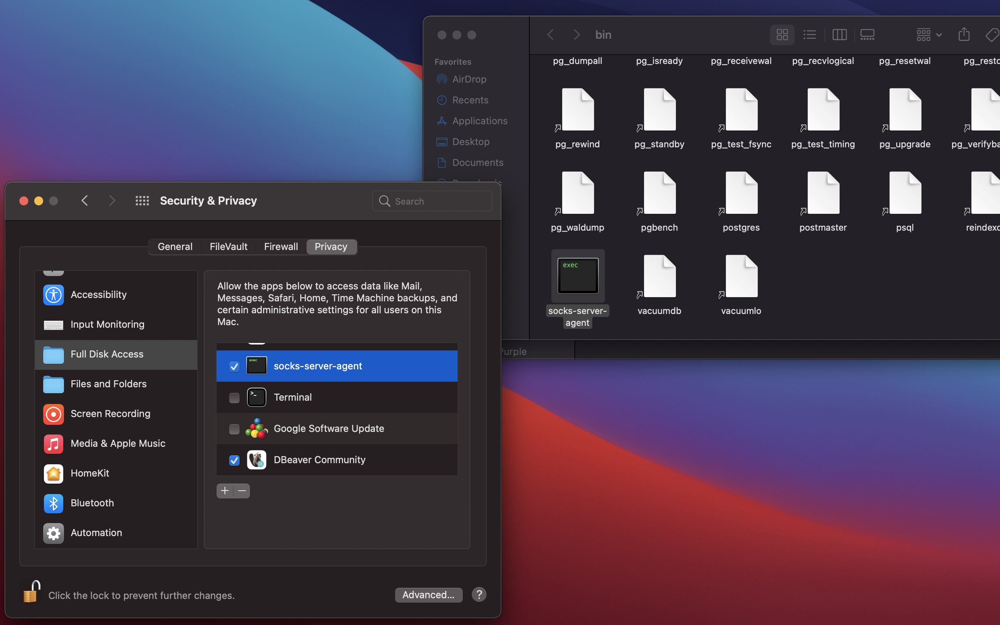

# SOCKS Proxy Launchd Agent

Simple launchd agent to keep running a socks proxy in macOs. This is useful for people who constantly use a socks proxy to browse the web, access private resources, bypass a firewall, etc. and want an always running socks server everytime they use their device.

## Prerequisites

- SHC, shell script compiler is used to generate a binary executable from a shell script. https://github.com/neurobin/shc

## Installation

1. Modify `socks-server.sh` to fit your ssh configuration
2. Run `install.sh`
3. Grant binary full disk access if you are using ssh pem keys (See section below)
4. Restart, the proxy should be running after user login

## Fixing issues with launchd and SIP (System Integrity Protection)

When using pem keys to connect to remote ssh server, it's possible access to the key is denied by SIP and the socks proxy is unable to start. To give the executable access, open Security & Privacy preferences, and open Full Disk Access. Finally drag and drop the executable:

